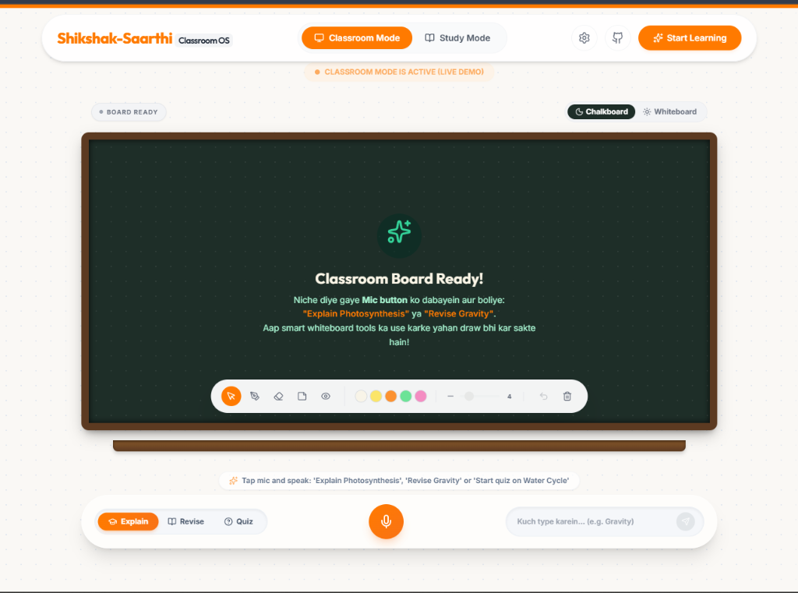
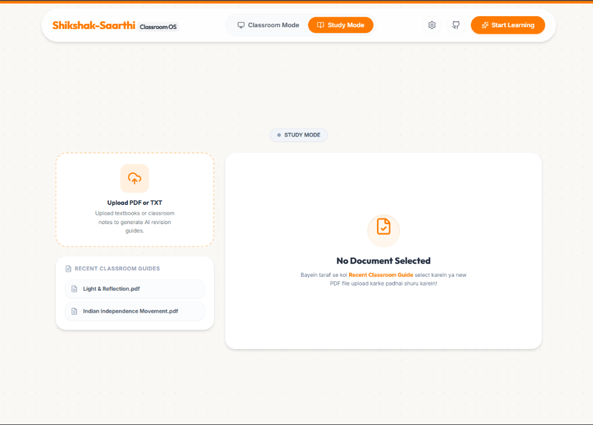

# 👨‍🏫 Shikshak-Saarthi (Classroom OS)

**Shikshak-Saarthi (Classroom OS)** is a premium, AI-powered interactive learning and teaching operating system designed for modern educators and students. By blending localized cultural analogies, custom voice synthesis, interactive canvases, and a local document manager, it builds an engaging environment for both classroom lecturing and independent study.

---

## 🎨 Visual Preview

### 1. Classroom Mode
Interactive smart chalkboard featuring visual mind maps, drawing tools, sticky notes, voice mic controller, and student understanding telemetry graphs.

### 2. Study Mode
Upload textbooks, notes, and PDFs to generate dynamic study guides, flashcards, and interactive quizzes with persistent local history.

---

## ⚡ Core Features

### 🎙️ 1. Teacher Persona & Accent Toggles (Multilingual)
Switch teaching styles and speech accents dynamically to match different regional backdrops and pedagogical tones:
*   **GuruG (Haryanvi Hinglish)**: Uses rural analogies (Haryana Roadways buses, danggal, fields) and colloquial encouraging terms (*"Arey balako..."*).
*   **Sat Sri Akal (Punjabi Hinglish)**: Warm Punjabi-accented educator drawing on local analogies (lassi, paratha, bhangra) and phrases (*"Oye Kakaji..."*).
*   **Shikshak (Standard Hindi)**: Highly polite, formal Hindi educator utilizing relatable public/assembly/local-train analogies (*"Namaskar priya chhatro..."*).
*   **Professor (Formal English)**: Global encouraging educator using clear, standard English explanations and standard academic analogies.

### 💾 2. Local Document Persistence & History (IndexedDB)
*   **Persistent Storage**: Uploaded textbooks and notes are saved directly in the browser's IndexedDB. Your study guides stay cached and accessible across page reloads without re-uploading.
*   **Clean Filenames**: Long system-generated unique UUID prefixes (e.g., `7c7d0f36_6a9b_...`) are automatically parsed and cleaned into readable dashboard labels.
*   **Instant Removal**: Manage your documents library with hover-to-reveal delete actions that securely wipe items from IndexedDB.

### 🧠 3. Smart NLP Intent Router
*   **Natural Language Triggering**: Type or speak instructions like *"Start a quiz on Quantum computing"* or *"Revise Photosynthesis"*. The API router automatically overrides standard tabs and redirects the view to the corresponding Mode (Quiz, Revise, or Explain).
*   **Regex Parsing**: Uses case-preserving regex matching to extract topics (e.g., `"Quantum computing"`) and determine intent before falling back to manual UI dropdown choices.

### 🚀 4. API Performance & Fallbacks
*   **3x Generation Speed**: Triggers parallel API requests (`explain`, `revise`, and `quiz`) using Promise pools so all resources load simultaneously.
*   **Load Balancing**: Automatically balance free requests across active endpoints via `openrouter/free` to mitigate rate limits.
*   **Paid API Failover**: If the free tier returns a `429 Too Many Requests` or takes more than 25 seconds, the request gracefully fails over to the paid `meta-llama/llama-3-8b-instruct` model to guarantee uninterrupted service.

---

## 🛠️ Technology Stack

*   **Frontend Framework**: Next.js 14 (App Router)
*   **Programming Language**: TypeScript
*   **Styles & Styling System**: Tailwind CSS & Vanilla CSS
*   **Database**: Client-side IndexedDB Wrapper
*   **Synthesizers**: HTML5 Canvas, Web Speech Synthesis (TTS), Web Speech Recognition (ASR)
*   **AI Integration**: OpenRouter API (`openrouter/free` & `meta-llama/llama-3-8b-instruct`), Groq (`llama3-8b-8192`), OpenAI (`gpt-4o-mini`)

---

## 🔒 Setup & Licensing

> [!CAUTION]
> **PROPRIETARY & LOCKED SYSTEM**
> This repository is private/closed and contains protected proprietary software. Unauthorized installation, compilation, distribution, deployment, or execution of this system is strictly prohibited.
>
> The codebase is built with strict runtime environment verification checks. Any attempts to run the server or compile the assets without valid authorization credentials (e.g. `SHIKSHAK_SAARTHI_LOCK`) will result in build-time exits and execution locks.
